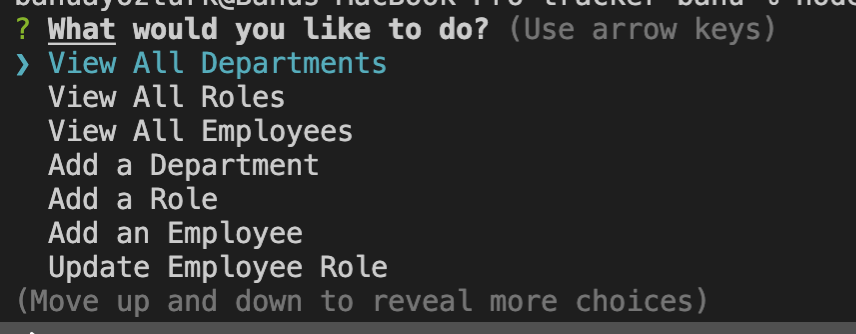
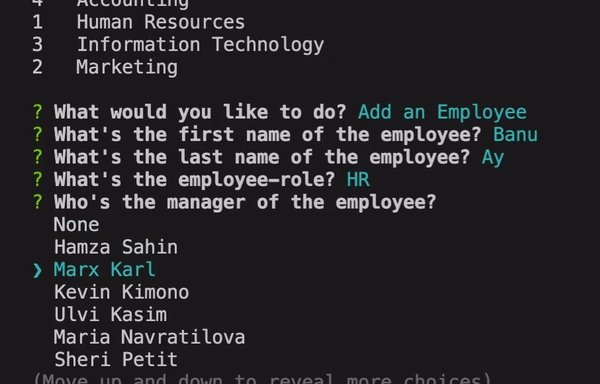

# employee-tracker

## Description

This is a sql database to track employees.User can view roles, employees, departments and modify the data by adding, updating and deleting. When users choose one of the titles, sub-titles appear as a table, so user can observe the modifications made.

## Screenshot

## Installation 

Steps required to install project and how to get the development environment running:

First run **npm install** in order to install the following npm package dependencies in the package.json:

- <i>inquirer</i> that will prompt you for your inputs from the command line
- <i>mysql2</i> node.js driver for mysql
- <i>console.table</i> prints an array of object as a table

Invoke the application with **node index.js**.

## Usage

When you run node index.js, the application uses the inquirer package to prompt you in the command line with a series of questions about  the application.

The application then takes your responses and uses mysql to get data, and console.module  to show the data as a table.

## Credits and Libraries

 [mysql2 npm package](https://www.npmjs.com/package/mysql2)

 [console.table npm package](https://www.npmjs.com/package/console.table)

 [tracker-app demo video](https://www.youtube.com/watch?v=NAG29V9oLpM)

 [mysql-node interaction](https://www.w3schools.com/nodejs/nodejs_mysql_create_db.asp)

 ## Contact Me
For any question about the project, please contact me.
[BanuAyozturk](mailto:bnyksl@gmail.com)

